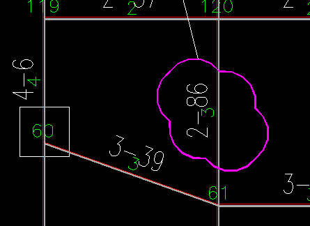
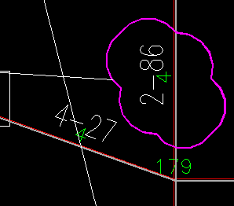
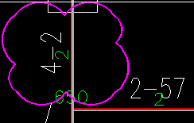
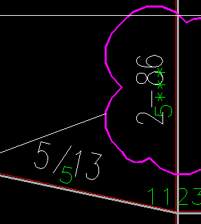
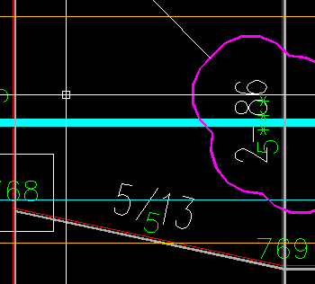

# 杆表生成器

#### 项目介绍
主要针对一些3维软件（如3D3S），默认生成图纸时仅有点坐标表格，没有对应的UNIT表格（杆件表格）。本程序通过读取绘制的点、杆平面图（上弦杆件布置图、下弦杆件布置图 etc.）自动导出杆件表格到CSV文件。以便于后续处理。

#### 安装教程

1. xxxx
2. xxxx
3. xxxx

#### 使用说明

1. unitbd

   unitbd适用于杆件直线端有节点编号（位于线端偏上），杆件所在图层区分了杆件型号的图纸。类似于3D3S。本命令会丢失杆件，生成的文件中包含error的线需要人工补上。建议生成模型后人工复查。

2. unithd

   unithd是适用于，杆件类型由线中附近（上、下、左、斜向）的文字进行描述，线端有节点编号（位于线端附近）的图纸，类似于MST出图。本命令会丢失杆件，生成的文件中包含error的线需要人工补上。建议生成模型后人工复查。

3. sph3s

    sph3s主要使用来将图纸中网架节点位置表示螺栓球/焊接球的文字与NODEID对应起来并按“nodeid,固定,螺栓球分类”导出到文件，可经后续调整后直接导入到3D3S的节点设计后处理。

    使用时__需要注意以下：__

    - nodeID文字对应图层“nodeid”
    - 球节点文字对应图层“sphty” 

#### Feature

1. 合并成单一命令，使用参数选择导出模式
2. 增加图形菜单，菜单中包含使用说明。
3. xxxx

#### bug

1. issue-001	杆件太短的时候，unithd,选框指定过大。端ID和截面文字挨得很近，出现了提取错误。

2. 附近杆件倾斜（或且本杆较短），unithd框选指定过大，选择了相近杆件的截面。（临时解决办法：将文字调小后再抓取)

  |      |      |
  | ---- | ---- |
  |      |      |
  |       |       |

